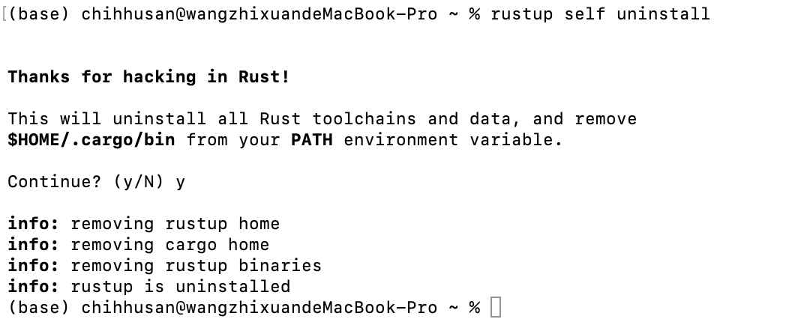
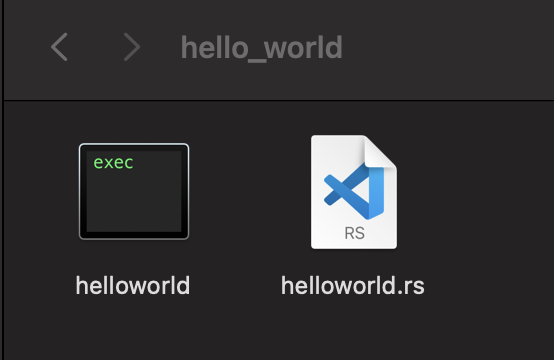
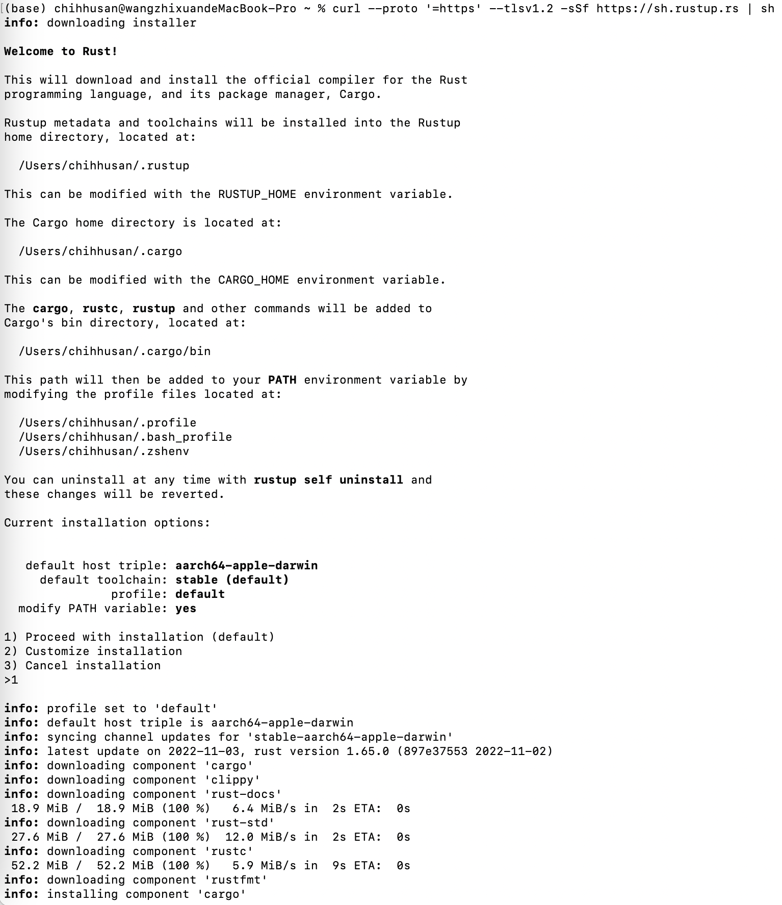

# RUST - Day1 - 安裝與Hello World!

環境: 這次我所使用的電腦是Mac喔，所以會有些語法與Windows不同，像是編譯完後，Windows會多一個.pdb的除錯文件，然後執行的時候後面需要多加exe，像是./helloworld.exe喔

## 一. 安裝

[官網](https://www.rust-lang.org/zh-TW/tools/install): [https://www.rust-lang.org/zh-TW/tools/install](https://www.rust-lang.org/zh-TW/tools/install)

### 安裝:

> curl --proto '=https' --tlsv1.2 -sSf [https://sh.rustup.rs](https://sh.rustup.rs/) | sh
> 



### 解除安裝:

> rustup self uninstall
> 



### 確定是否有安裝完成 - 查看rustc版本

> rustc —version
> 

```rust
(base) chihhusan@wangzhixuandeMacBook-Pro ~ % rustc --version
rustc 1.65.0 (897e37553 2022-11-02)
```

### 更新rustup工具

rustup負責管理及安裝RUST所有工具

> rustup update
> 

```rust
(base) chihhusan@wangzhixuandeMacBook-Pro ~ % rustup update
info: syncing channel updates for 'stable-aarch64-apple-darwin'
info: checking for self-updates

  stable-aarch64-apple-darwin unchanged - rustc 1.65.0 (897e37553 2022-11-02)

info: cleaning up downloads & tmp directories
```

Step 1: 創建新檔案，副檔名為.rs

創建一個helloworld.rst檔案

Step 2: 撰寫RUST程式碼 

```rust
fn main() {
    println!("Hello World !");
}
```

1. main(): 所有可執行的RUST檔中永遠第一個執行的程式，如果沒寫的話，程式編譯過程會報錯喔
2. fn <function Name> () {}: 創建一個函式

Step 3: 編譯

rustc <編譯的程式檔>

```rust
base) chihhusan@wangzhixuandeMacBook-Pro hello_world % rustc [helloworld.rs](http://helloworld.rs/)
```

編譯完後會出現一個執行檔



Step 4: 執行

./<執行檔>

```rust
base) chihhusan@wangzhixuandeMacBook-Pro hello_world % ./helloworld
Hello World !
```

恭喜恭喜，相信有寫過其他語言的大家一定對Hello World並不陌生，我們正式跨入了RUST的領域!!